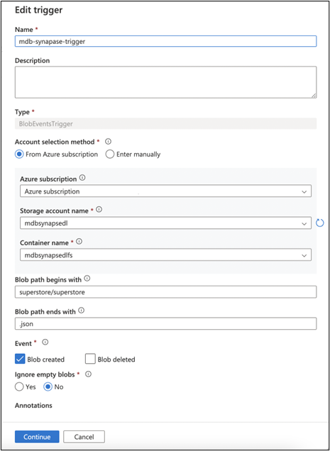

# Real-Time Sync Solution for MongoDB Atlas Integration with Synapse

## Use Case

This solution details the deployment of all the components required for you to set up a real-time sync between an MongoDB Atlas instance and a Synapse dedicated SQL pool. This means that any change (Insert, Update, or Delete) in a MongoDB Atlas collection is immediately reflected in the Synapse dedicated SQL pool. Thus, analytics and dashboards that are based on dedicated SQL pools will always reflect the current data.

The following diagram shows you the deployment workflow:

 

## Deployment Steps

**The solution will deploy the below components in the order shown in the diagram**

1\. The one-click deploy allows you to create the Synapse workspace, its corresponding Azure Data Lake Storage (ADLS) Gen2 storage with a container, a dedicated SQL pool and instance of Event Grid. Create a directory within the container that you created in the ADLS Gen2 storage.

2\. Fork the code from the GitHub repo, and make the changes to the _appsettings.json_ file.

Select the code based on whether a storage trigger or an event-based trigger is preferred.

3\. Click the button below to set up an App Service plan, an App Service instance with the code from your forked Public repo.

4\. Import the Copy Pipeline zip file that's attached, to import the Pipeline into the Synapse workspace.

5\. Create a storage trigger from Azure Synapse Studio (if you're using a storage trigger).

OR

Create a custom event trigger from Synapse Studio (if you're using an Event Grid based trigger).

 

## Pre-requisites

### Mongo Setup

-   Create a free MongoDB Atlas account [here](https://www.mongodb.com/docs/atlas/getting-started).

    Follow all the steps in the above link to register for a new Atlas account. Create a cluster and then connect to the cluster. You can also load sample data.

### Azure Account

-   You must have an existing Azure account. If you don't have an Azure subscription, create a [free account](https://azure.microsoft.com/free/?WT.mc_id=A261C142F) before you begin.

 

## Step 1 - Synapse Workspace Setup

**Create a Synapse workspace, ADLS Gen 2 storage, a dedicated SQL pool, and an Event Grid instance**

1\. Click the “Deploy to Azure” button below.

  > **Note:** The "Deploy to Azure" button above will redirect you to the Azure portal, with a reference to the resulting [ARM template file](./Templates/SynapseMainTemplate.json). You can use this file to create a Synapse workspace, ADLS Gen2 storage, a dedicated SQL pool, and an Event Grid instance. 

2\. The form below appears to capture the details required to create the following components:

-   Synapse workspace and Azure Data Lake Storage Gen2 attached to the workspace:
    -   Dedicated SQL pool
    -   Event Grid topic
-   The below parameters are used to create the **Synapse workspace** and **ADLS Gen2** and **container** within the **ADLS Gen2**.

Provide values for the resource group, the region for deployment, the name for the Synapse workspace, the name for the ADLS Gen2 storage account, and the SQL admin login ID and password. The rest of the parameters can be left to the default values.

Also, provide the container name for the container that you'll created within the ADLS Gen2 storage account.

-   The below parameters are to be given to create the **Dedicated SQL Pool**.

Provide values for the SQL pool name, the SKU denoting the [DWH instance type](https://azure.microsoft.com/pricing/details/synapse-analytics), and the [location](https://docs.microsoft.com/azure/azure-resource-manager/templates/resource-location?tabs=azure-powershell). The rest of the parameters can be left to the default values.

-   The below parameters are to be given to create the **Event Grid**.

Provide the Event Grid topic name to which the Changestream will write an event when a change is detected. There is no need to add a subscription, as it gets automatically attached when a trigger is created in Synapse.

3\. Create a directory within your container in the newly created ADLS Gen 2 account that's associated with the Synapse workspace. Use the [Azure portal](https://docs.microsoft.com/azure/storage/blobs/data-lake-storage-explorer) or CLI to go to the ADLS Gen2 storage, and then create a directory within it.

Ensure that Azure Synapse, Data Factory, SQL, Storage, and Event Grid are added as resource providers in the subscription.

 

## Step 2 - Configuration Changes for Change Streams Capture

1. The code for App Service is located in the below Github repos:

-   Storage Trigger Based Code:

    <https://github.com/Azure/SynapseRTSStorage>

    -   The code mainly watches for the changes from MongoDB Atlas, and it then writes a blob in the ADLS Gen2 storage, which is picked by the storage trigger to trigger the pipeline.

-   Event Trigger Based Code:

    <https://github.com/Azure/SynapseRTSEventGrid>

    -   The code mainly watches for the changes from MongoDB Atlas, and it then writes a blob in the ADLS Gen2 storage, which is picked by the storage trigger to trigger the pipeline.
    -   Additionally, it also writes a new event to the Event Grid topic.
    -   Fork the preferred repo, and make the changes to the “**appsettings.json”** file, to provide values according to your MongoDB and Synapse setup. Note that the forked repo should be set to “**Public**”. If there are any concerns with keeping the repo public, then clone the repo, make the changes, and then publish to Azure App Service using Visual Studio.

| Parameter                | Value                                                                                                                                                            |
|--------------------------|------------------------------------------------------------------------------------------------------------------------------------------------------------------|
| mongoDb-connection       | The connection URL for your MongoDB instance, such as mongodb+srv://\<id\>:\<password\>@\<clusterurl\>?retryWrites=true&w=majority                                    |
| mongodb-database         | The database name in your MongoDB instance                                                                                                                       |
| mongodb-collection       | The collection to be watched for changes in your MongoDB database                                                                                                |
| topic-endpoint           | The Event Grid topic endpoint (only applicable if you're using the Event Grid based trigger mechanism)                                                                      |
| topic-key                | The access key to be able to write an event to the topic (only applicable if you're using the Event Grid based trigger mechanism)                                           |
| dataLakeGen2-accountName | Name of the ADLS Gen2 instance that's created for the Synapse workspace                                                                                                         |
| dataLakeGen2-accountKey  | Access key for the ADLS Gen2 storage account to be able to write to the storage account                                                                         |
| fileSystemName           | File system name (container name) in the ADLS Gen2 storage of the container that's created in Step 3                                                                   |
| dataLakeGen2Uri          | The Primary endpoint for the DataLake Storage. Can be obtained from the Settings -\> endpoints-\> Data Lake Storage -\> Primary End Points -\> Data Lake Storage |
| container                | The directory that is manually created within the Data Lake Storage container as in Step 1.3                                                                     |
| fileType                 | Default to “Paraquet”                                                                                                                                            |
 

## Step 3 - Create App Service and deploy the Event publishing Code

1\. Click the below “Deploy to Azure” button to create an App Service plan and instance and to deploy the code with your changed settings to the App Service instance.
    

  > **Note:** The "Deploy to Azure" button above will redirect you to the Azure portal, with a reference to the resulting [ARM template file](./Templates/SynapseAppServiceTemplate.json), which you can use to create an App Service instance and to deploy the event publishing code.
   
-   The below parameters can be used to create the App Service plan and App Service instance.

    

    Provide values for your App Service name (the site name), the App Service plan name (the hosting plan name), your forked public repo URL, and its branch (main or another branch), along with the other basic information. The rest of the parameters can be left to the default values. If you're not publishing using a public repo, then leave “Repo URL” to the default value, and overwrite the App Service deployment with Visual Studio publishing from your cloned repo.

-   Once the Web App is running, it will open an HTML page, as shown below, which indicates that the App Service instance is running at the URL endpoint for the App Service.

    

 

## Step 4 - Create Synapse Pipelines

1\. Import the pipelines into the Synapse workspace you created.

-   Attached below is the zip file to import into the newly created workspace for a real-time sync:

    [Pipeline Zip](https://github.com/Azure/RealTimeSync_Synapse-MongoDB/blob/0eb888b0f96a713abbc3e44ec1aa13531187a5e4/Storage-CopyPipeline_mdb_synapse_ded_pool_RTS.zip)

Follow the steps below to import the pipeline:

-   Create a table in the dedicated SQL pool, as per your MongoDB collection.
    -   Select “Add a new resource” from the Integrate tab in Azure Synapse Studio.

-   Select the “Import from Pipeline template” option, and browse to the location on your machine where the zip folder is saved to.

Once the zip folder is given, the pipeline will be created, and the user will be asked to provide the linked service that pertains to the Synapse account.

In inputs For **sourcejson (json dataset)** - Add a new linked service that points to the ADLS Gen2 storage that's associated with Synapse to store the JSON blobs.

Click “Open Pipeline” after you supply the above values. The template validation will indicate that “**DestinationDataset_miu1**”, the dedicated SQL pool is required. Click on “**DestinationDataset_miu1”** to set it up, pointing to your dedicated SQL pool and the table in it, instead of the default [dbo].[Superstore].

In the _Sink_ settings, change the _Key Columns_ value from “RowID” to your column for upsert. The pipeline will check if a row exists in the SQL table, with the same value for the specified _Upsert Column_. If it exists, it updates the row, or else it will insert a new row.

Open the “sourcejson” linked service in _Source_, and make sure to give the correct “File Path” by replacing the container name/ directory name with your values that replace the default “mdbsynapsedlfs/superstore”.

Publish the pipeline. Once a file is created after a change is made to the MongoDB collection (ensure Appservice is running), pass that filename and Debug/ Trigger now to the pipeline to test the pipeline.

Make sure to add yourself to two roles - “Owner” and “Storage Blob contributor” - to the ADLS Gen2 storage, or else you may get a “Forbidden” error.

 

## Step 5 - Create Synapse Triggers

1\. Create the **Storage Trigger** or the **Custom Trigger**, as per your preference, by following the screenshots below.

**Storage Trigger**

Select the Event Type as “Storage Events”, and provide your subscription, the storage account name of the ADLS Gen2 storage, and the container (file system) within the storage. Give the “\<directory name\>/\<directory name\>” as the Blob begins-with value and “.json” as its end-with value.

After selecting **Continue,** you get to see the data preview and the current files in the directory that match the criteria.

Also, after selecting **Continue**, you can define the parameter as “@trigger().outputs.body.fileName” to be passed from the trigger to the pipeline. In this solution, we need the filename of the blob with the delta change that triggered the pipeline and that's passed to the pipeline.

**Custom Event Trigger**

Select the Event Type as “Custom Events” and provide your subscription and the Event Grid topic name. Give the subject-begins-with value as “MongoDB Change Stream Connector” and the event types as “Update” and “Insert”.

Also, after selecting **Continue**, you can define the parameter as “@triggerBody().event.data.fileName” to be passed from the trigger to the pipeline. In this solution, we need the filename of the blob with the delta change, which the pipeline has to pick for changes, to update the dedicated SQL pool.

 

## Test

-   To test real-time, go to the Mongo Cluster, and make a change in the values of the fields in the collection.
-   Verify that App Service is up and running.
-   Verify the directory within the container of the ADLS Gen2 storage to check if a new blob was added for the document that was changed.
-   Verify that the trigger (Storage/Event) was triggered in the Monitoring tab of Azure Synapse Studio.
-   Verify that the pipeline was triggered and completed successfully.
-   Verify that the dedicated SQL pool was updated, by querying the changed document.

 

## Contributing

This project welcomes contributions and suggestions.  Most contributions require you to agree to a
Contributor License Agreement (CLA), which declares that you have the right to, and actually do, grant us the rights to use your contribution. For details, visit https://cla.opensource.microsoft.com.

When you submit a pull request, a CLA bot will automatically determine whether you need to provide
a CLA and decorate the PR appropriately (such as status check, comment, and so on). Simply follow the instructions that are provided by the bot. You will only need to do this once across all repos using our CLA.

This project has adopted the [Microsoft Open Source Code of Conduct](https://opensource.microsoft.com/codeofconduct/).
For more information see the [Code of Conduct FAQ](https://opensource.microsoft.com/codeofconduct/faq/) or
contact [opencode@microsoft.com](mailto:opencode@microsoft.com) with any additional questions or comments.

 

## Trademarks

This project may contain trademarks or logos for projects, products, or services. Authorized use of Microsoft trademarks or logos is subject to and must follow 
[Microsoft's Trademark & Brand Guidelines](https://www.microsoft.com/en-us/legal/intellectualproperty/trademarks/usage/general).
Use of Microsoft trademarks or logos in modified versions of this project must not cause confusion or imply Microsoft sponsorship.
Any use of third-party trademarks or logos are subject to those third-party's policies.
