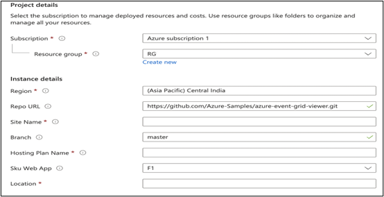
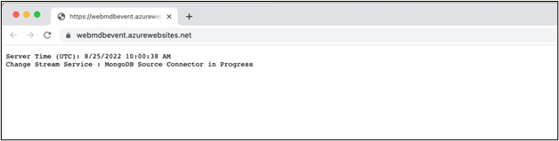
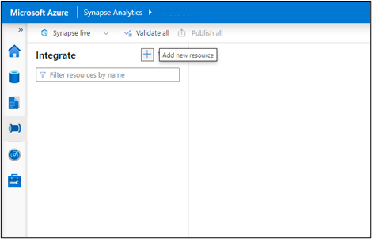
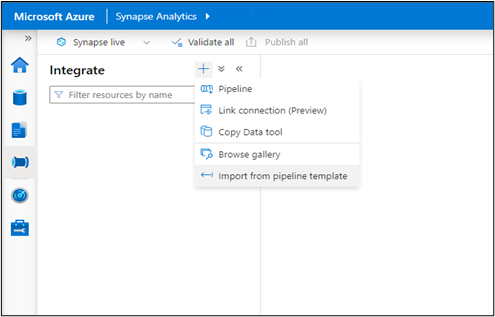
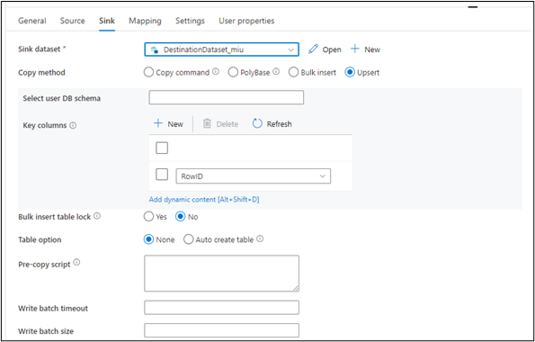
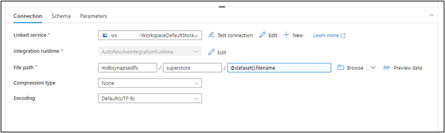
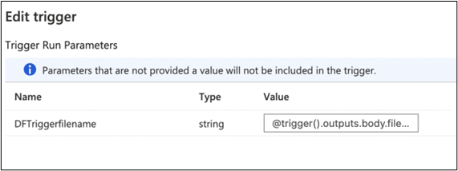

# Real Time Sync Solution for MongoDB Atlas Integration with Synapse

## Use-Case:

The Solution details deployment of all components required for setting up a Real-time Sync between MongoDB Atlas instance and Synapse Dedicated SQL Pool. This means that any change (Insert, Update or Delete) in MongoDB Atlas collection is immediately reflected in the Synapse Dedicated SQL Pool. Thus, analytics and dashboards based on Dedicated SQL Pools will always reflect current data.

Deployment Workflow:

## The solution will deploy below components in the order shown in the diagram:

1\. One-click deploy allows the creation of the Synapse Workspace, its corresponding ADLS Gen 2 storage with a container, Dedicated SQL Pool and Event Grid. Create a directory within the container created in the ADLS Gen 2 storage.

2\. Fork Code from GitHub repo and make the changes to the “appsettings.json”.

Code needs to be selected based on whether a Storage trigger or Event based trigger is preferred.

3\. Click the button below to set up an App Service Plan, an App service with the code from your forked Public repo.

4\. Import the Copy Pipeline zip file attached to import the Pipeline into the Synapse Workspace.

5\. Create a Storage trigger from Synapse Studio (if using Storage Trigger)

OR

Create a Custom Event trigger from Synapse Studio (if using Event Grid based Trigger)

## Pre-requisites:

### Mongo Setup

-   Create a Free MongoDB Atlas account using [link](https://www.mongodb.com/docs/atlas/getting-started/)

    Follow all the steps in the above link to Register for a new Atlas account, create a cluster, connect to the same and you can also Load sample data.

### Azure Account

-   You must have an existing Azure account. If you don't have an Azure subscription, create a [free account](https://azure.microsoft.com/free/?WT.mc_id=A261C142F) before you begin.

## Step 1 - Synapse Workspace Set Up

### Create Synapse Workspace, ADLS Gen 2 storage, Dedicated SQL Pool and Event Grid

1\. Click the below “Deploy to Azure” button

[**Synapse Main Template**](https://github.com/Azure/RealTimeSync_Synapse-MongoDB/blob/0eb888b0f96a713abbc3e44ec1aa13531187a5e4/SynapseMainTemplate.docx)

2\. The form below appears to capture the details required to create:

-   Synapse Workspace and Azure Data Lake Storage Gen 2 attached to the Workspace
    -   Dedicated SQL Pool
    -   Event Grid topic
-   Below parameters are to be given to create the **Synapse Workspace** and **ADLS Gen2** and **container** within the **ADLS Gen2**

Provide values for the Resource Group, Region for deployment, name for the Synapse workspace, name for the ADLS Gen 2 storage account and the SQL Admin Login Id and Password. The rest of the parameters can be left to default values.

Also, provide the Container name for the container to be created within the ADLS Gen 2 storage account.

-   Below parameters are to be given to create the **Dedicated SQL Pool**

Provide values for the SQL Pool Name, the SKU denoting the [DWH instance type](https://azure.microsoft.com/en-us/pricing/details/synapse-analytics/) and the [Location](https://docs.microsoft.com/en-us/azure/azure-resource-manager/templates/resource-location?tabs=azure-powershell). The rest of the parameters can be left to default values.

-   Below parameters are to be given to create the **Event Grid**

Provide the Event Grid Topic Name to which the Changestream will write an event when a change is detected. There is no need to add a subscription as it gets automatically attached when a trigger is created in Synapse.

3\. Create a directory within your container in the newly created ADLS Gen 2 account associated with the Synapse Workspace. Use [Azure portal](https://docs.microsoft.com/en-us/azure/storage/blobs/data-lake-storage-explorer) or CLI to go to the ADLS Gen 2 storage and create a directory within it.

Ensure that Azure Synapse, Data Factory, Sql, Storage, Event Grid are added as Resource Providers in the subscription.

### 

 
 

## Step 2 - Configuration Changes for Change Streams Capture
 
1\. Code for the App service is located in the below Github repos:

-   Storage Trigger Based Code :

    <https://github.com/Azure/SynapseRTSStorage>

    -   The code mainly watches for the changes from MongoDB Atlas and writes a blob in the ADLS Gen 2 storage which is picked by the Storage Trigger to trigger the Pipeline

-   Event Trigger Based Code:

    <https://github.com/Azure/SynapseRTSEventGrid>

    -   The code mainly watches for the changes from MongoDB Atlas and writes a blob in the ADLS Gen 2 storage which is picked by the Storage Trigger to trigger the Pipeline
    -   Additionally, it also writes a new event to the Event Grid topic
    -   Fork the preferred repo and make the changes to the “**appsettings.json”** file to provide values according to your MongoDB and Synapse Set Up. Please note that the forked Repo should be “**Public**”. If there are any concerns with keeping the repo Public, please clone the repo, make the changes, and Publish to Azure App Service using Visual Studio.

| Parameter                | Value                                                                                                                                                            |
|--------------------------|------------------------------------------------------------------------------------------------------------------------------------------------------------------|
| mongoDb-connection       | The connection url for your MongoDB instance e.g mongodb+srv://\<id\>:\<password\>@\<clusterurl\>?retryWrites=true&w=majority                                    |
| mongodb-database         | The Database name in your MongoDB instance                                                                                                                       |
| mongodb-collection       | The Collection to be watched for changes in your MongoDB database                                                                                                |
| topic-endpoint           | Event Grid Topic endpoint (only applicable if using the Event Grid based trigger mechanism)                                                                      |
| topic-key                | Access key to be able to write an event to the topic (only applicable if using the Event Grid based trigger mechanism)                                           |
| dataLakeGen2-accountName | Name of the ADLS Gen 2 created for the Synapse Workspace                                                                                                         |
| dataLakeGen2-accountKey  | Access key for the ADLS Gen 2 storage account to be able to write to the storage account                                                                         |
| fileSystemName           | File System name (container name) in the ADLS Gen 2 storage of the container created in Step 3                                                                   |
| dataLakeGen2Uri          | The Primary endpoint for the DataLake Storage. Can be obtained from the Settings -\> endpoints-\> Data Lake Storage -\> Primary End Points -\> Data Lake Storage |
| container                | The directory that is manually created within the Data Lake Storage container as in Step 1.3                                                                     |
| fileType                 | Default to “Paraquet”                                                                                                                                            |
 
 

## Step 3 - Create App Service and deploy the Event publishing Code
 

-   Click the below “Deploy to Azure” button to create an App service Plan, App service and to deploy the code with your changed settings to the App Service.

    **Synapse AppService template**

    
    > **Note:** The "Deploy to Azure" button above will redirect you to the Azure Portal with a reference to the resulting [ARM template file](./Deploy/AzureAnalyticsE2E.json) generated by the build of the Bicep code. Please refer to Bicep files for the true source of the code for this accelerator.

-   Below parameters are to be given to create the App Service Plan and App Service

    

    Provide values for your App Service Name (Site name), the App Service Plan name (Hosting Plan name), your forked Public Repo URL and its branch (main or another branch) along with the other basic information. The rest of the parameters can be left to default values. If not publishing using Public repo, then leave “Repo URL” to the default value and overwrite the App service deployment with a Visual studio publishing from your cloned repo.

-   Once the Web App is running, it will open an HTML page as below indicating that the App Service is running at the URL endpoint for the App Service.

    

 
 

## Step 4 -Create Synapse Pipelines
 

1\. Import the Pipelines into the Synapse Workspace created

-   Below attached is the zip file to Import into the newly created workspace for Real-Time Sync

    [Pipeline Zip](https://github.com/Azure/RealTimeSync_Synapse-MongoDB/blob/0eb888b0f96a713abbc3e44ec1aa13531187a5e4/Storage-CopyPipeline_mdb_synapse_ded_pool_RTS.zip)

Follow below steps to Import the Pipeline:

-   Create a table in the Dedicated SQL Pool as per your MongoDB collection
    -   Select “Add a new resource” from the Integrate Tab in the Synapse Studio.

-   Select the “Import from Pipeline template” option and Browse to the location on your machine where the zip folder is saved to.

Once the zip folder is given, the Pipeline will be created, and the user will be asked to provide the Linked service pertaining to the Synapse account.

In Inputs For **sourcejson (json dataset)** - Add a New linked service pointing to the ADLS Gen 2 storage associated with Synapse to store the json blobs

Click “Open Pipeline” after supplying the above values. Template validation will indicate that “**DestinationDataset_miu1**”, the Dedicated SQL Pool is required. Click on “**DestinationDataset_miu1”** to set it up pointing to your Dedicated SQL Pool and the table in it instead of the default [dbo].[Superstore].

In the Sink settings, change Key Columns value from “RowID” to your column for Upsert. The Pipeline will check if a Row exists in the SQL table with the same value for the specified Upsert Column. If it exists, it updates the row, else it will insert a new row.

Open the “sourcejson” linked service in Source and make sure to give the correct “File Path” by replacing the container name/ directory name with your values replacing the default “mdbsynapsedlfs/superstore”.

Publish the Pipeline. Once a file is created after a change is made to the MongoDB collection (ensure Appservice is running), pass that filename and Debug/ Trigger now the pipeline to test the pipeline.

Make sure to add yourself to roles - “Owner” and “Storage Blob contributor” to the ADLS Gen 2 storage, else you may get a “Forbidden” error.

## Step 5 -Create Synapse Triggers

1\. Create the **Storage Trigger** or the **Custom Trigger** as per your preference following the screenshots below

**Storage Trigger**

Select Event Type as “Storage Events” and provide your Subscription, Storage account name of the ADLS Gen 2 storage, container (file system) within the storage, give the “\<directory name\>/\<directory name\>” as the Blob begins with value and “.json” as its end with value.

On selecting **Continue,** you get to see the Data Preview and the current files in the directory matching the criteria.

Further on selecting **Continue,** you can define the parameter as “@trigger().outputs.body.fileName” to be passed from the trigger to the Pipeline. In this solution, we need the filename of the blob with the delta change that triggered the Pipeline passed to the Pipeline.

**Custom Event Trigger**

Select Event Type as “Custom Events” and provide your Subscription, the Event Grid topic name, give the Subject begins with as “MongoDB Change Stream Connector” and the Event types as “Update” and “Insert”.

Further on selecting **Continue,** you can define the parameter as “@triggerBody().event.data.fileName” to be passed from the trigger to the Pipeline. In this solution, we need the filename of the blob with the delta change that the Pipeline has to pick for changes to update the Dedicated SQL Pool.

 
 

## Test

-   To Test real-time, go to Mongo Cluster, make a change in the values of the fields in the collection
-   Verify that App Service is up and running
-   Verify the directory within the container of the ADLS Gen 2 storage to check if a new blob was added for the document that was changed
-   Verify that the trigger (Storage/ Event) was triggered in the Monitoring tab of the Synapse Studio
-   Verify that the Pipeline was triggered and completed successfully
-   Verify that the Dedicated SQL pool was updated by querying the changed document
